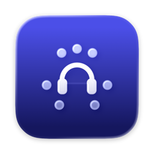
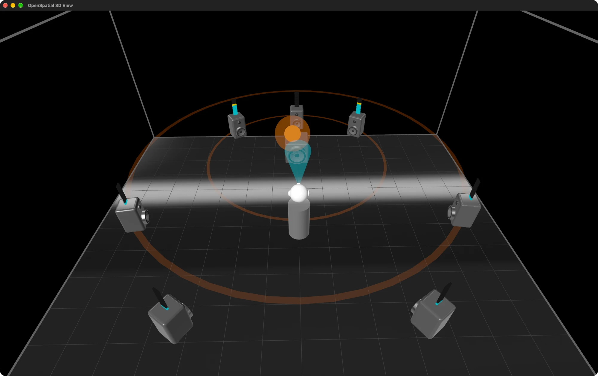
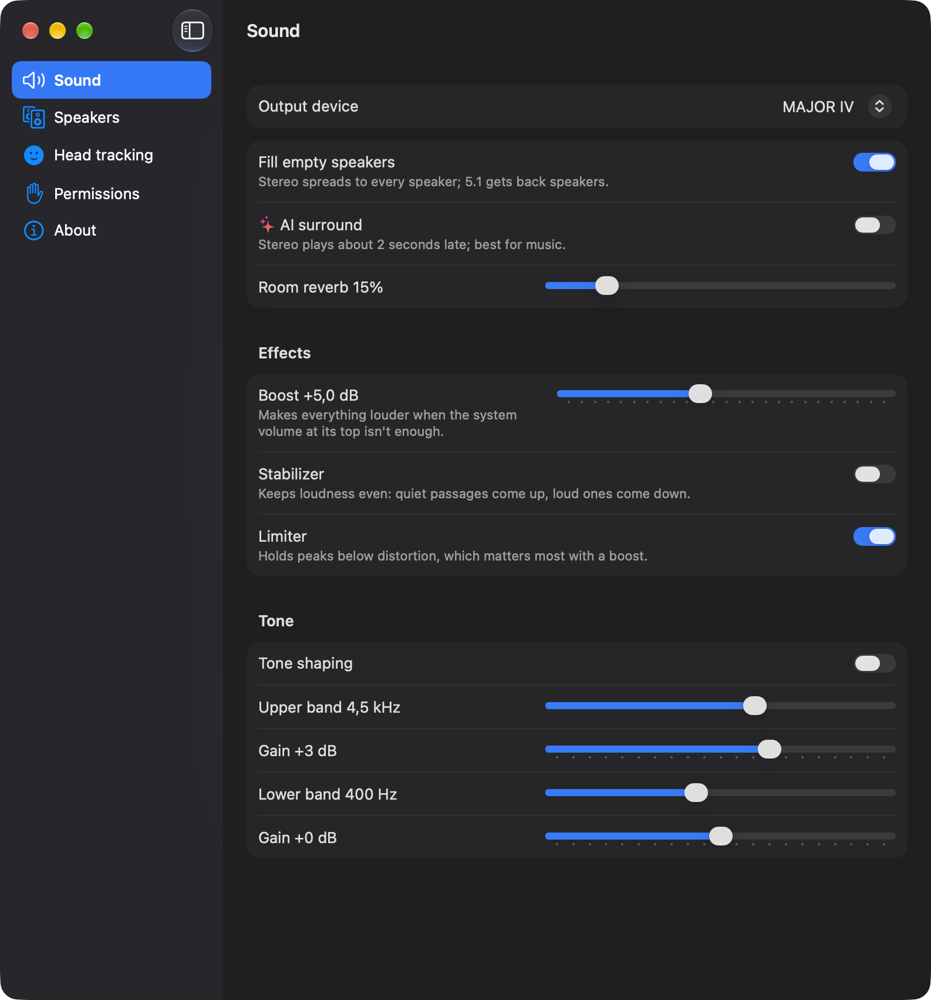
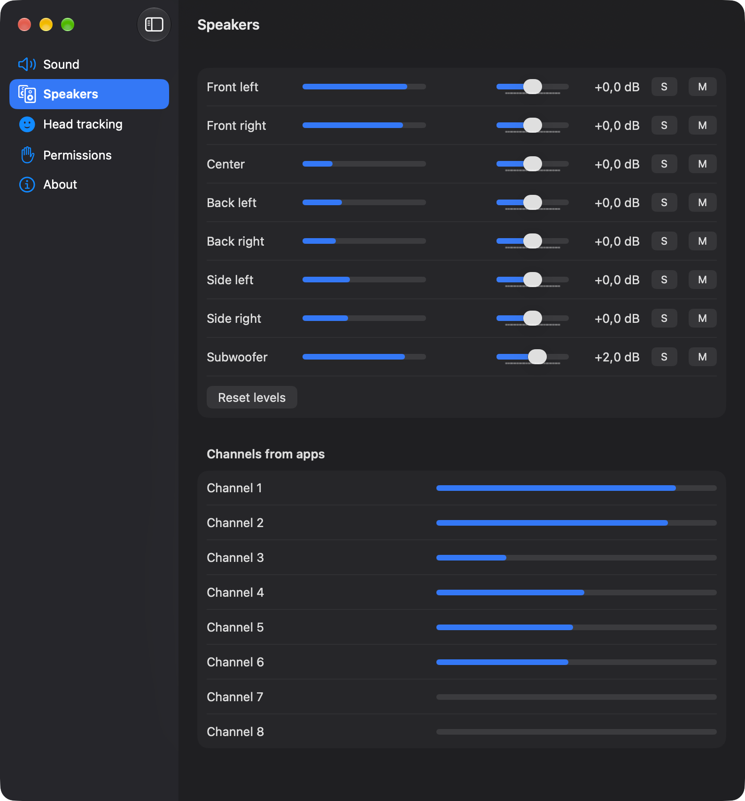
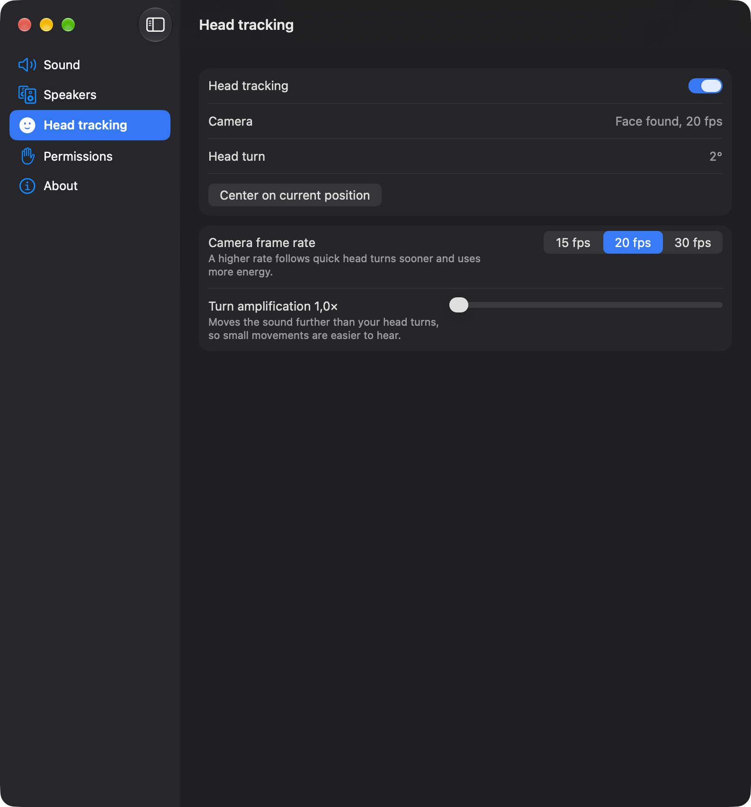
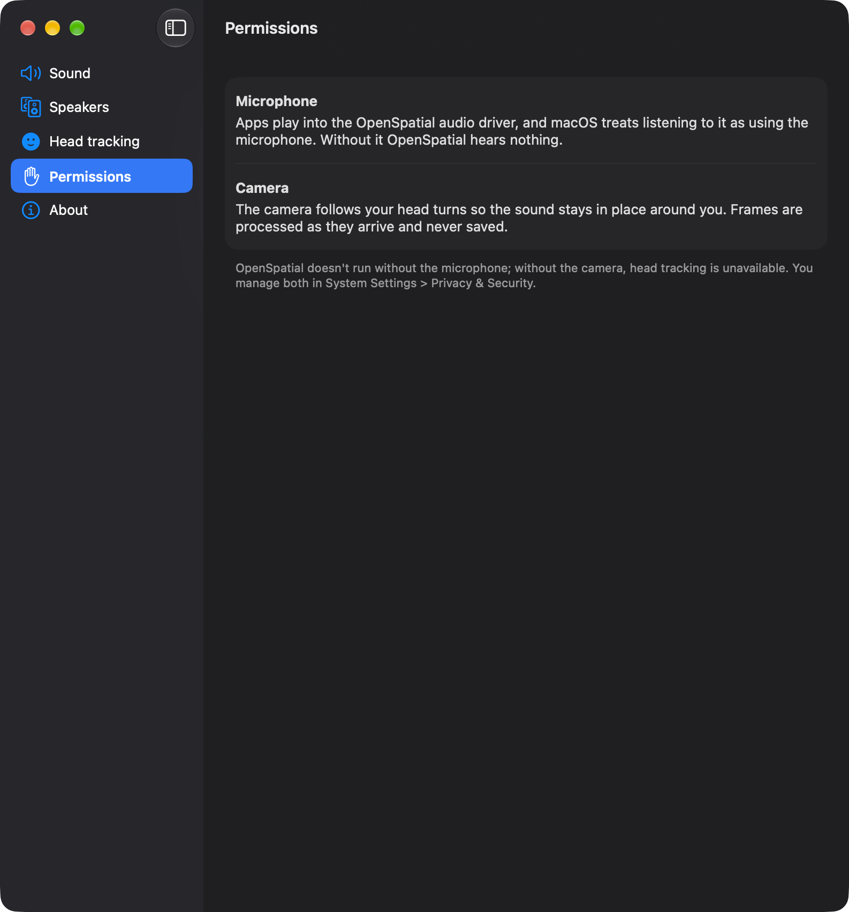
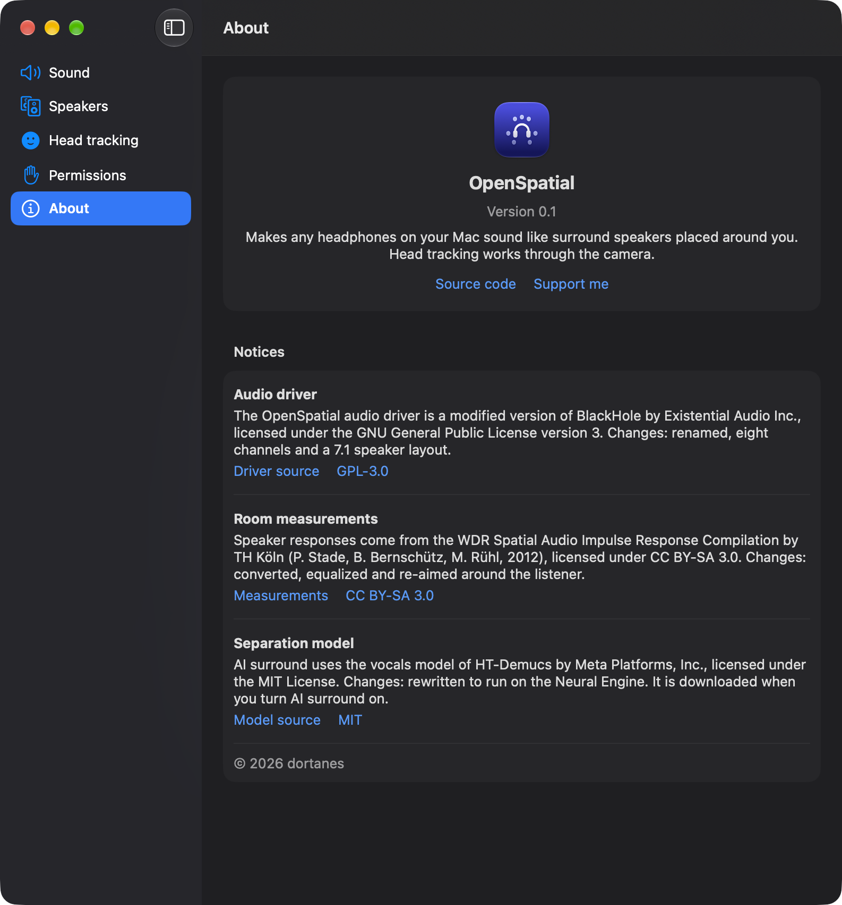

# OpenSpatial



<p><strong>Spatial Audio for Mac on any headphones.</strong></p>
<p>OpenSpatial turns the headphones you already have, wired or wireless, into 7.1 surround with head tracking. It works with every app on your Mac: movies, games and music.</p>
<p>
  <a href="https://github.com/dortanes/openspatial/releases/latest"></a>
  <a href="LICENSE"></a>
</p>
<p>
  <a href="#features">Features</a> ·
  <a href="#screenshots">Screenshots</a> ·
  <a href="#download">Download</a> ·
  <a href="#get-started">Get started</a> ·
  <a href="#privacy">Privacy</a> ·
  <a href="#build-from-source">Build from source</a> ·
  <a href="#credits">Credits</a> ·
  <a href="#support-openspatial">Support</a>
</p>

<br clear="left">

<p align="center"></p>

## Features

- **Any headphones, any app.** Wired or wireless, over-ear or in-ear; browsers, players, games and music apps.
- **Speakers that stay put.** With head tracking on, your Mac's camera follows your head, so the front stays in front.
- **Surround from stereo.** Stereo spreads to every speaker around you, and 5.1 gets its missing back speakers.
- **AI surround.** Pulls the voice out of stereo and puts it in front of you, the way a center speaker does in a cinema.
- **Louder and even.** Boost quiet apps, even out loud and quiet scenes, and shape the tone.
- **See the sound.** Watch the speakers play and where each sound comes from in a 3D view of the room.
- **Works with Wine.** Windows games play in full 7.1.

## Screenshots

<table>
  <tr>
    <td></td>
    <td></td>
    <td></td>
  </tr>
  <tr>
    <td></td>
    <td></td>
    <td></td>
  </tr>
</table>

## Download

Get the latest version from [Releases](https://github.com/dortanes/openspatial/releases/latest). It needs a Mac with Apple silicon and macOS 15 or later.

## Get started

1. Move OpenSpatial to Applications and open it. Its icon appears in the menu bar.
2. On first launch, OpenSpatial installs its audio driver and asks for your password.
3. Allow the microphone when macOS asks: it is how OpenSpatial hears your apps. Allow the camera if you want head tracking.
4. Click the menu bar icon, open **Settings**, and choose your headphones under **Sound → Output device**.
5. Play anything. The menu bar panel shows what is playing and lets you turn spatial sound, AI surround and head tracking on and off.

Tips:

- **AI surround** works best for music. Stereo plays about 2 seconds late with it on, so turn it off for videos and games.
- If the front isn't where your screen is, look at the screen and click **Center on current position** in **Settings → Head tracking**.
- **Settings → Speakers** plays each speaker on its own, so you can check where it sits and set its level.
- **3D view** in the menu bar panel shows the room live.

## Privacy

Sound and camera frames never leave your Mac, and camera frames are never stored. OpenSpatial goes online only to download the AI surround model when you turn it on. Without the camera, everything but head tracking works.

## Build from source

You need Xcode 26 or later and [uv](https://docs.astral.sh/uv/).

```sh
git clone https://github.com/dortanes/openspatial.git
cd openspatial
app/build.sh                  # app in app/build/OpenSpatial.app
open app/build/OpenSpatial.app
```

[CONTRIBUTING.md](CONTRIBUTING.md) covers what the build downloads, signed builds and releases.

## Credits

- Audio driver: [BlackHole](https://github.com/ExistentialAudio/BlackHole) by Existential Audio, GPL-3.0.
- Room responses: WDR Spatial Audio Impulse Response Compilation by TH Köln (P. Stade, B. Bernschütz, M. Rühl, 2012), [CC BY-SA 3.0](https://creativecommons.org/licenses/by-sa/3.0/), from the [SOFA database](https://sofacoustics.org/data/database/thk/); converted, equalized and re-aimed around the listener.
- AI surround model: [HT-Demucs](https://github.com/facebookresearch/demucs) by Meta Platforms, MIT.

## Community

Report bugs and suggest features in [Issues](https://github.com/dortanes/openspatial/issues). Report vulnerabilities privately as described in [SECURITY.md](SECURITY.md).

## Support OpenSpatial

OpenSpatial is free and built in spare time. If it is useful to you, a donation helps keep it going.

<a href="https://ko-fi.com/dortanes"></a>

<details>
<summary>Donate USDT</summary>

| Network | Address |
| --- | --- |
| TON | `UQDdOJ-e67sTvdkw3QbstGXiWa3KmB7_QUs98JZ-s53IPsyw` |
| TRON (TRC-20) | `TNdEYdDKnfFt84wervgywr1iNg3ununuYw` |
| Ethereum (ERC-20) | `0x464e564580C76D252CC8A9aF1994dA4eCacEEaC7` |
| Solana | `GfcK6LRhTWGYHQYSGoqTaYRssk4xGV26XywpCwkA9BPJ` |

Send only USDT, and only on the network listed next to the address.

</details>

## License

Copyright © 2026 dortanes.

OpenSpatial is free software: you can redistribute it and/or modify it under the terms of the [GNU General Public License v3.0](LICENSE) as published by the Free Software Foundation.

---

<p align="center">
  If OpenSpatial makes your headphones sound bigger, please <a href="https://github.com/dortanes/openspatial">⭐ star the repository</a>.<br>
  It helps others find the project and keeps development going.
</p>
